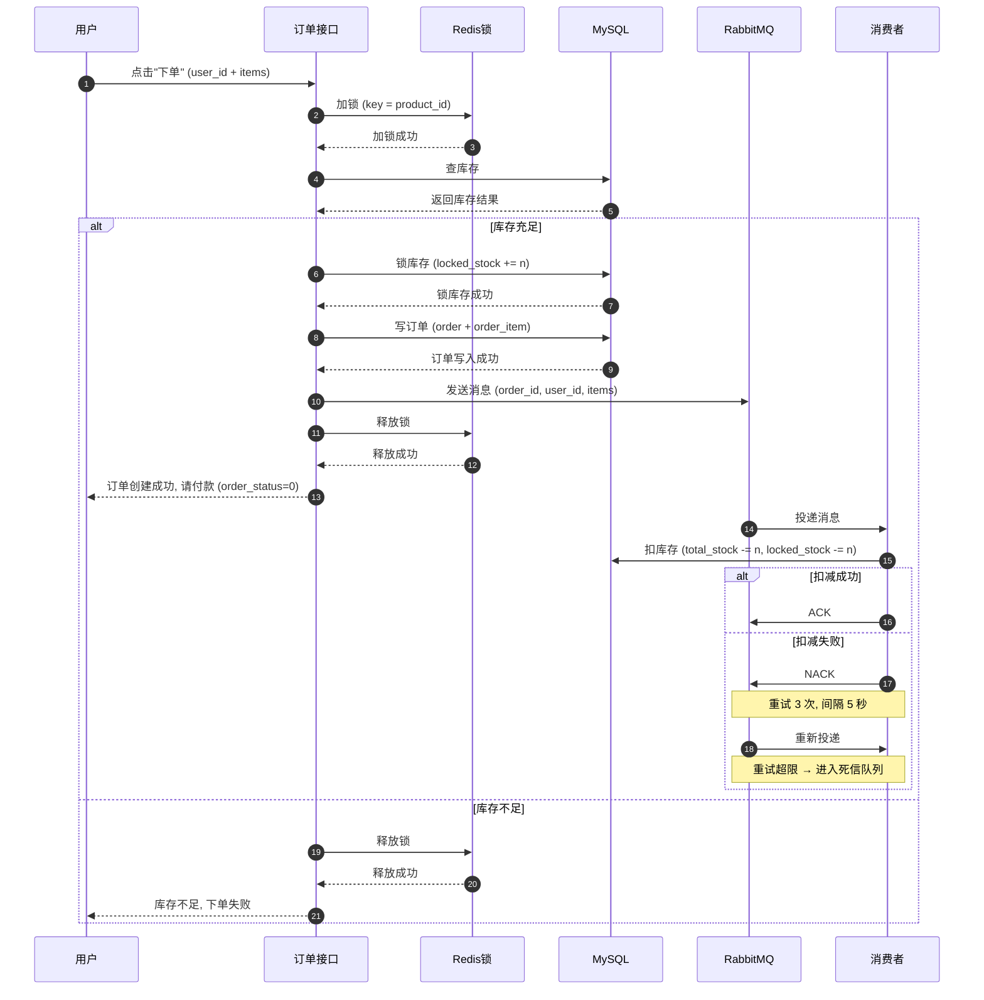
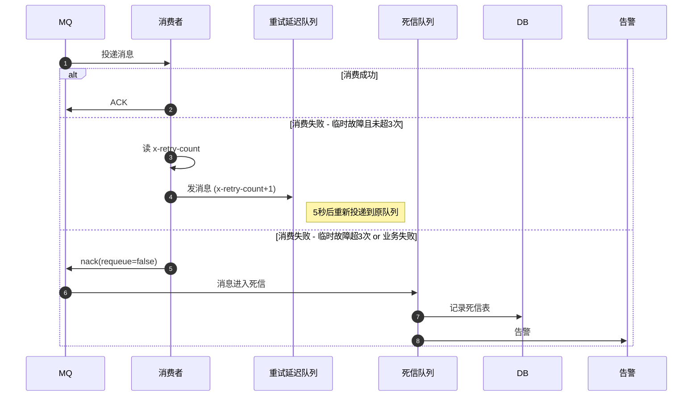

### 创建订单流程

### 消费者重试与死信流程

### 说明

**锁**
- 锁的 key：`product_id`（按商品粒度锁，不同商品互不影响）
- 锁的持有范围：加锁 → 查库存 → 锁库存 → 写订单 → 发MQ → 释放锁
- 锁的释放时机：发完 MQ 即释放，不等消费者

**MQ 消息内容**
- order_id：消费者定位订单
- user_id：日志追踪
- items：商品列表，每项含 product_id、order_item_num、order_item_amount

**消费者**
- 只做一件事：扣减库存（total_stock -= n, locked_stock -= n）
- 不改订单状态、不写物流（这些属于付款流程）

**重试策略**
- 重试 3 次，间隔 5 秒
- 超限 → 死信队列

**库存不足分支**
- 释放锁 → 返回用户"库存不足"，订单不创建